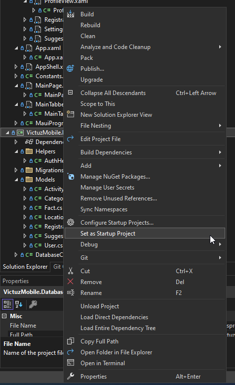
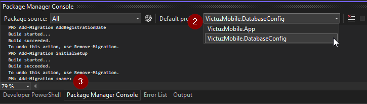

# VictuzMobile

Setting up the project:
1. Configure VictuzMobile.App to be your startup project (see screenshot below)
    
2. Make sure your emulator is set to the correct one
3. Pending migrations are automatically run whenever you start the project/emulator

## Creating a migration
1. Set VictuzMobile.DatabaseConfig as your startup project (see screenshot)
	
2. Inside your Package Manager Console set VictuzMobile.DatabaseConfig as the default project (see screenshot)
	
3. Enter the following code (replace <name> with an apropriate name)
```powershell
Add-Migration <name>
```
3.1 If you get an error stating that you have multiple versions of EntityFramework installed enter the following instead:
```powershell
EntityFrameworkCore\Add-Migration <name>
```
