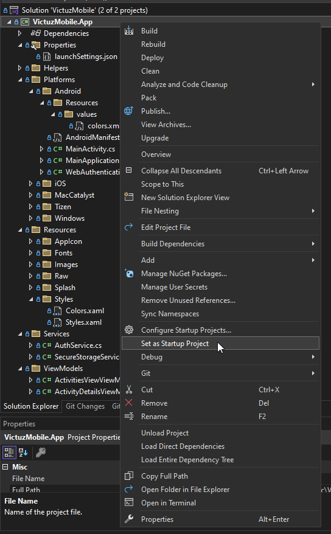

# VictuzMobile

Setting up the project:
1. Configure VictuzMobile.App to be your startup/default project (see screenshot below)
    
2. Make sure your emulator is set to the correct one
3. Pending migrations are automatically run whenever you start the project/emulator

## Creating a migration
```c#
dotnet ef migrations add <name> --startup-project src/VictuzMobile.DatabaseConfig/ --project src/VictuzMobile.DatabaseConfig/
```

